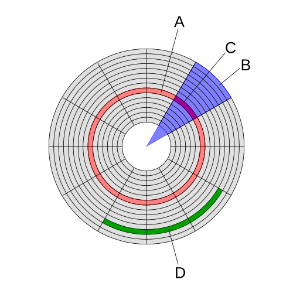
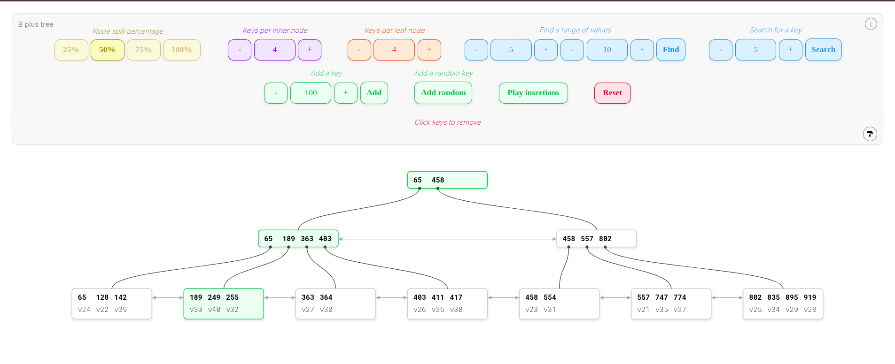

# SQLite source files are public domain. Original source: https://sqlite.org
## Much love to the SQLite team for this amazing piece of software.
Learning from it is an amazing experience and I highly recommend going through the source code for anyone interested in databases.

## Database in Depth - Sample Projects

- There is no network layer because the client and server share the same memory space
- Tokenizer used to create tokens from the query
- Optimiser used to optimise the queery 
- parser use to parse queries 

cap theorem

here is an image explain sector and tracks in detail 

here is an image for b tree and b plus tree

